# SPX - Battle Royale - Live Result Package

To obtain more information and access to the software, please visit https://services.euroelite.online/. We offer various options, ranging from a simple stream for your event to full-scale production on your channel, as well as free use of the software for you and your events.

# Files in this package
All the files are configured on different layers for user-friendly accessibility in SPX. They are added in a way that even a novice can quickly grasp the operation. Simply follow from top to bottom and play them sequentially. The layers always stack on top of each other. Below, you'll find a list of all the templates offered in this package, divided into the categories "During the Game" and "After the Game."

# During the Game

## 01_live-ticker.html
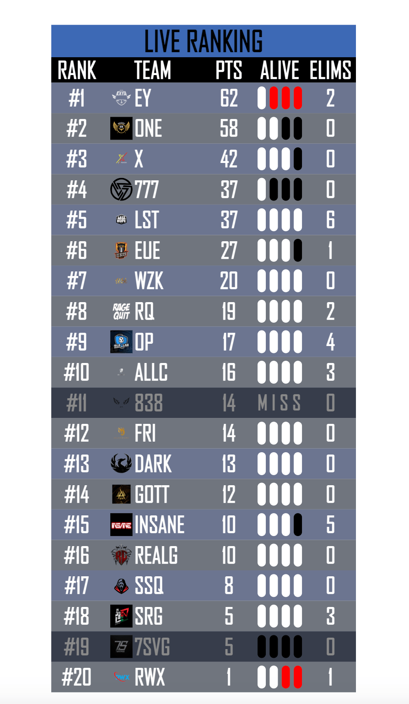

## 02_eliminated.html
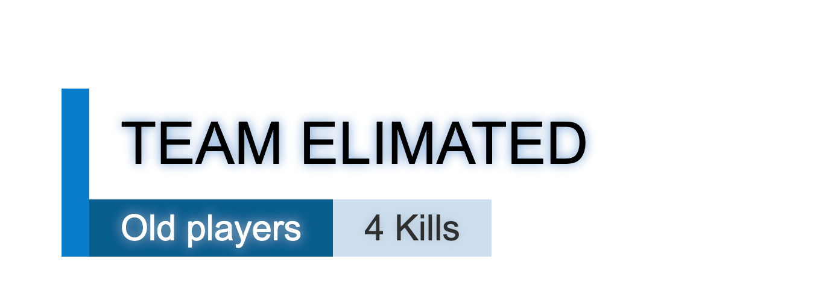

## 03_player-stats.html
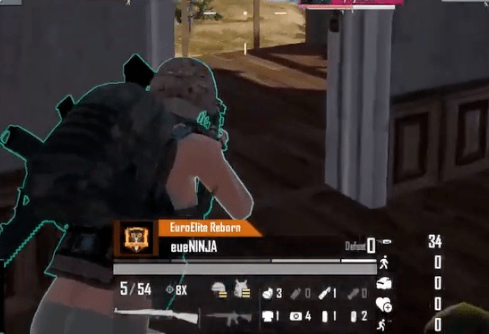

## 05_map-overlay.html
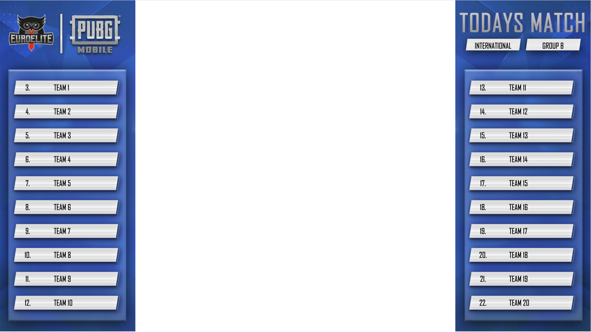

# After the Game

## 10_winner-screen.html
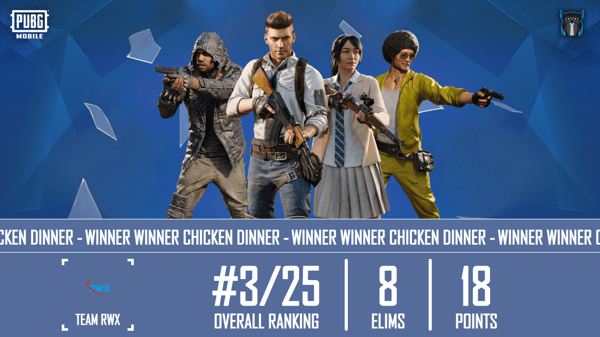

## 11_match-ranking.html
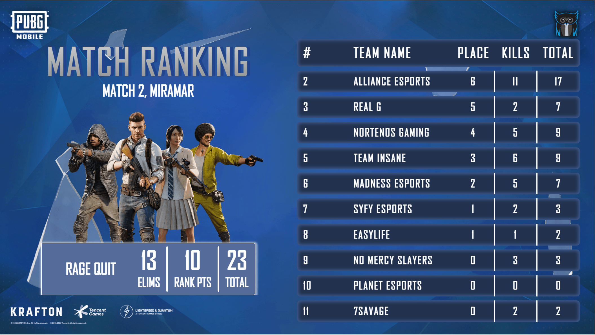

## 12_match-graph.html
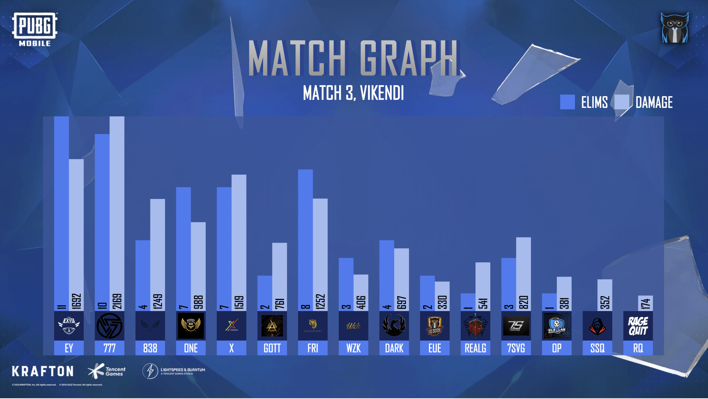

## 13_top-elims.html
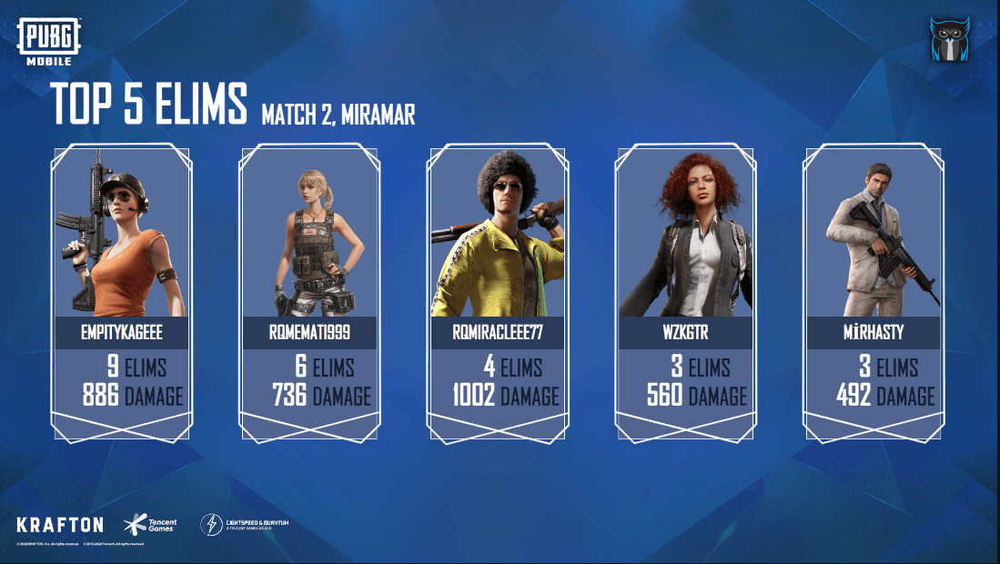

## 14_top-elims-overall.html

## 15_overall-standings.html

## 16_table-result.html
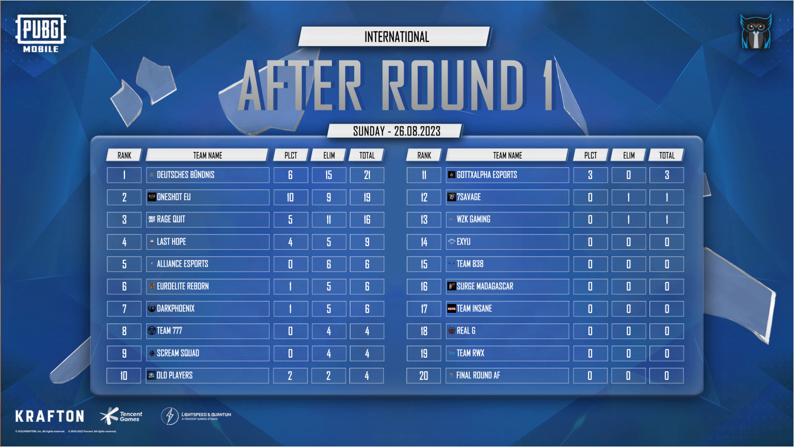

## 17_map-overview.html
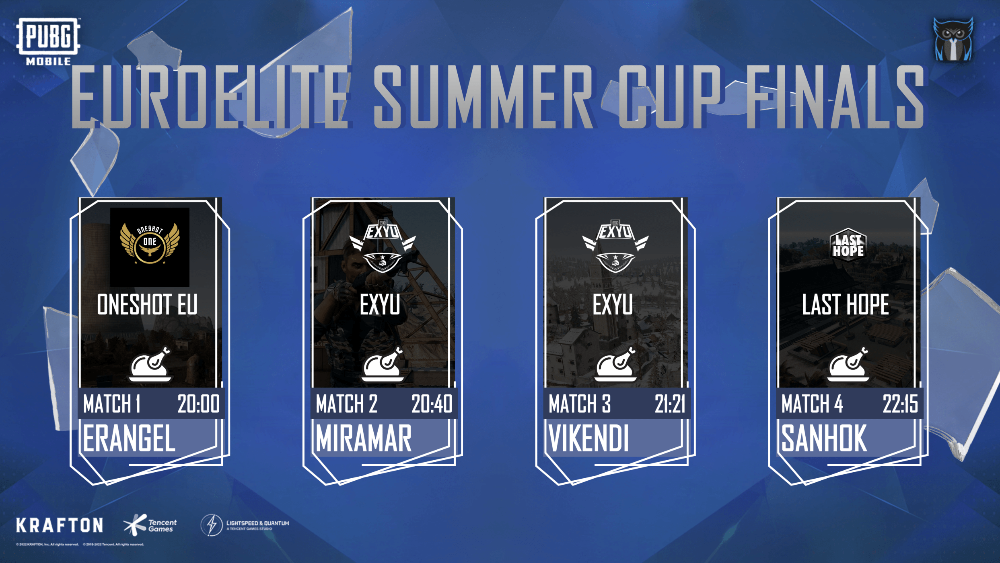

## 18_points.html
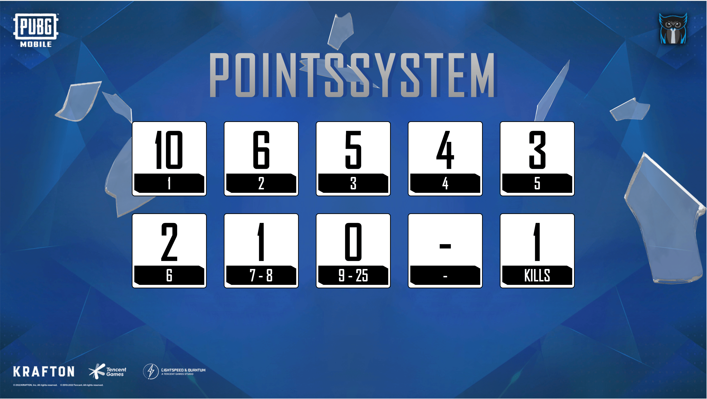

## 19_slots.html
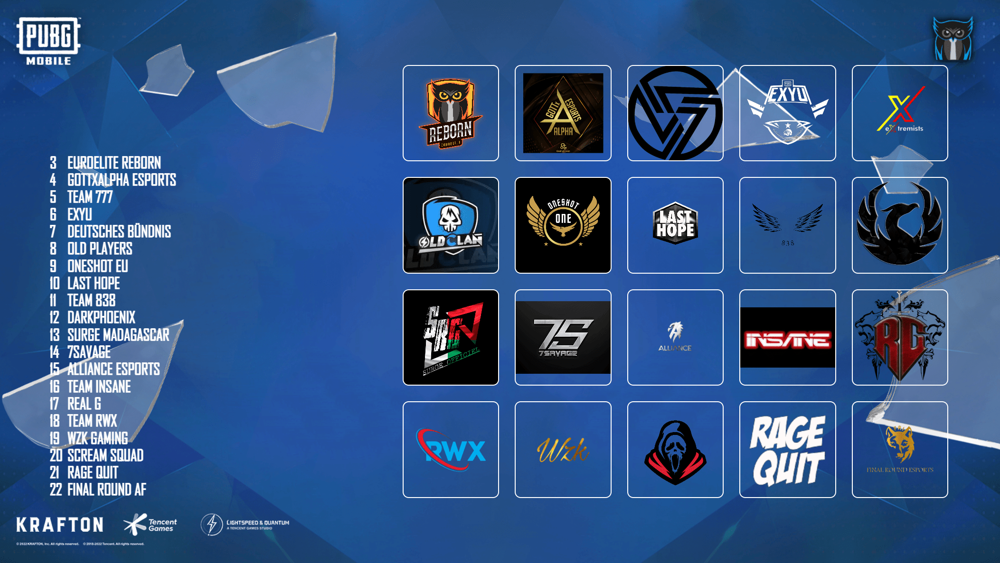

## Branding
Modify `css/standard.css` for your needs. You can make you own branding including background and color.
the most important part is to setup your background.png which gets used for all screens. You can also use animated background within background.mp4. If background.mp4 exist it will be shown above background.png

## Logos
Don't forget to activate "show logos" for the screen. This demo include all logos and will show properly. Put all logos in `team_logos` folder by `$tag.png`

## PCOB Logo
Please make sure you config the same setting for ALL PC OBs and put team logos in both PCs, since the PC OB client just reads and displays local files.

The logos are also required for PCOB to show ingame. The special format with 3 different sizes is a lot of work. You can use my [PUBG Mobile PCOB Logo and Ini Generator](https://github.com/roest01/PUBG-Mobile-PCOB-Logo-and-INI-Generator) Script to automate the work. It will create the required files and link them in TeamLogoAndColor.in
1. 256 X 256 pixels  > as $tag.png
2. 64 X 64 pixels > as $tag_64.png
3. 128 X 128 pixels  > as $tag_128.png
4. 256 X 256 pixels  > as $tag_256.png

## Controls
https://docs.google.com/spreadsheets/d/1RsvaO_OZKQGVjGbXPVf8giL3ax70nqWCo4tBvNdDE64/edit#gid=0
(**DEMO SHEET ONLY**). _This is a payed software. So inputs are disabled within this link._

Use the INPUT sheet only. Update data in "Live Results" area and insert results after match finished.

## Team logos
package can use with or without logos. Use the toggle in spx interface to activate logos. Be sure all logo files are in place in team_logos folder named by team tag. Each logo has to be png file. Squares works best but every format will get displayed. 

## Game running
run "live ranking" and "eliminated" both on different layers. The eleminated message get displayed when a team reach 0 players in ALIVE field. Be sure to update "kills" first for this team before killing it via sheet. 

## After game
When the game is over enter the winning team immediately into the first field of the round. Use the tag and insert kills very fast. Then display the winner screen. Then you have time to fill out the remaining results while the winner stream is visible or go into highlights. 

## After results
When you have insert all results into the round you can display statistics and match results screen. The spx layout automatically use the latest round as data source. No need to select round manually. The overall result allows you to select a round so youre be able to compare the rounds and use next to animate from round 1 into round 2 

## Use the layers
The animation is way smoother if you use the layer feature of spx. Put winner screen on layer 8 and match ranking on layer 9. That way you can enable one screen after another and it get animated over the latest screen. If you put all screens on layer 7 you have a very hard cut when changing views. Use one layer for each file and proceeed for example with match graph on layer 10. 

The rundown in spx is prepaired like this. You can simply play all files from top to buttom for each round. Layer 1-5 is preserved while game is running. Layer 10 (winner screen) starts imidiatly after game is finished. **just "play" from top to bottom.

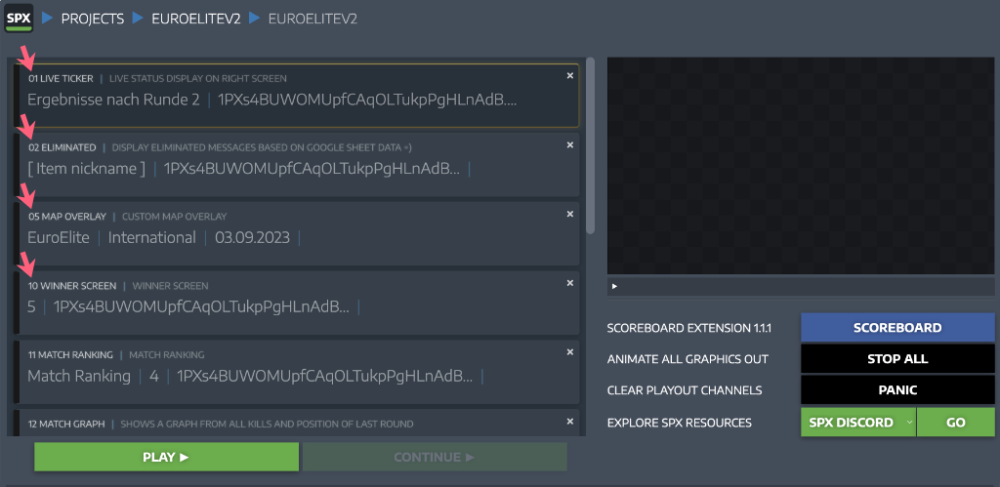

Get in touch on https://discord.gg/euroelite and ask for roest.
